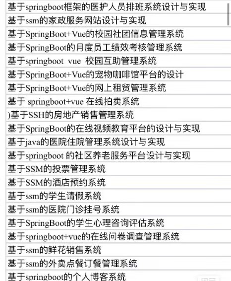
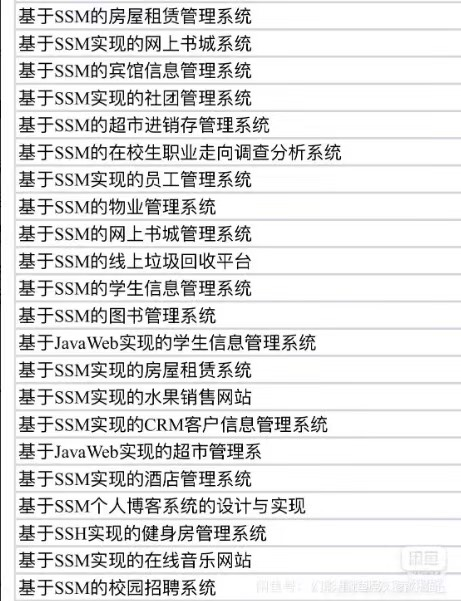
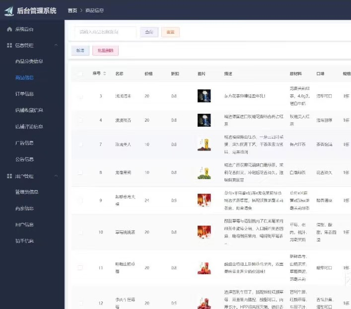
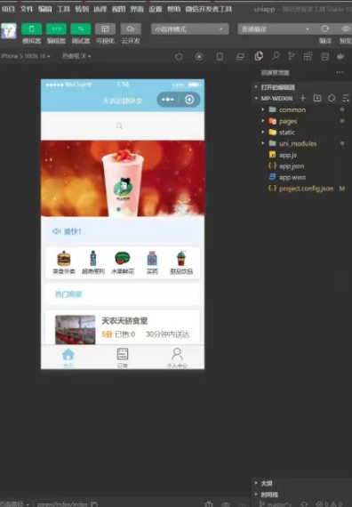

# studyJava
基于SpringBoot的学生心理咨询评估系统 基于springboot+vue的在线问卷调查管理系统 基于ssm的鲜花销售系统 基于ssm的外卖点餐订餐管理系统 基于springboot的个人博客系统 基于SSM的房屋租赁管理系统 基于SSM实现的网上书城系统 基于SSM的宾馆信息管理系统 基于SSM实现的社团管理系统 基于SSM的超市进销存管理系统 基于SSM的在校生职业走向调查分析系统 基于SSM实现的员工管理系统 基于SSM的物业管理系统 基于SSM的网上书城管理系统 基于SSM的线上垃圾回收平台 基于SSM的学生信息管理系统 基于SSM的图书管理系统 基于JavaWeb实现的学生信息管理系统 基于SSM实现的房屋租赁系统基于SpringBoot的学生心理咨询评估系统

3000多套精心整理的JAVA项目源码合集，涵盖了SSM Springboot
JSP、Vue框架，uniapp等。这些源码经过精心筛选和整理，质量上乘，适合各种技术水平的开发者使用和学习。
包含全部项目，可以自己挑选合适的

### 完整项目获取

通过网盘分享的文件：3300套JAVA毕业设计项目成品源码

链接: https://pan.baidu.com/s/1-QLWjWeOSucI3V_2A53vlg?pwd=rs3n 提取码: rs3n
--来自百度网盘超级会员v4的分享

最新更新项目

链接: https://pan.baidu.com/s/1GcBN8LTgEOwZ6cNdD7LxRg?pwd=4n6m 提取码: 4n6m
--来自百度网盘超级会员v4的分享

通过网盘分享的文件：工具包

链接: https://pan.baidu.com/s/1YmdoJvkjoUjA75wvHLDZ6A?pwd=xm96 提取码: xm96
--来自百度网盘超级会员v3的分享

需要远程项目部署或项目修改和毕业设计也可联系（添加申请时请备注好来意）

通过网盘分享的文件：远程调试部署联系方式

链接: https://pan.baidu.com/s/1W0dDcoZmayG0c7USJDYBYg?pwd=nqd7 提取码: nqd7
--来自百度网盘超级会员v3的分享

### 项目合集(项目不断更新中)
链接: https://pan.baidu.com/s/1nY-zhvAK0CXYcn3g7LzQnQ?pwd=id3c 提取码: id3c
--来自百度网盘超级会员v3的分享

#### 这些项目一起发你了 可以分享给你需要的同学 调试可找我 也接二次修改和项目定制、毕业设计等

### 扫码关注公众号 获取更多项目和编程资料

关注公众号：小猿天天学习

公众号ID：xzzard

## 接毕业设计和论文

微信联系方式：xzxj0206  QQ：3808981644   (支持修改、 部署调试、 支持代做毕设)

